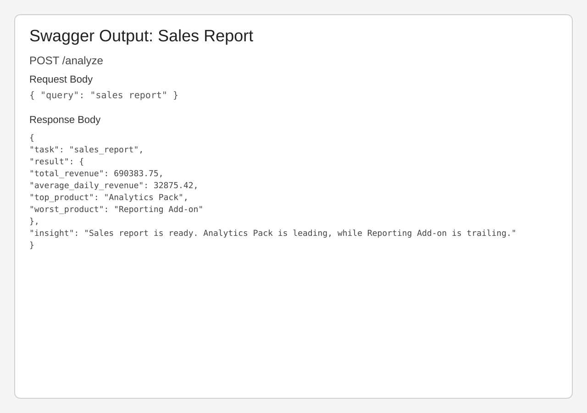
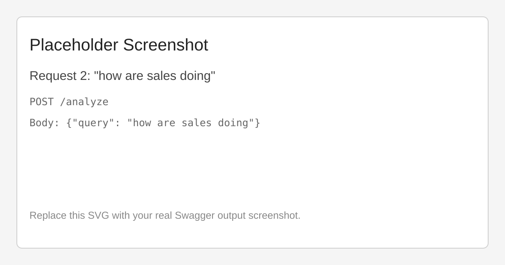
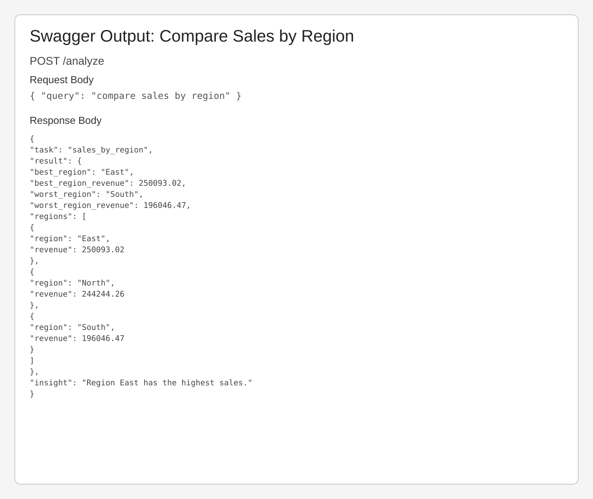
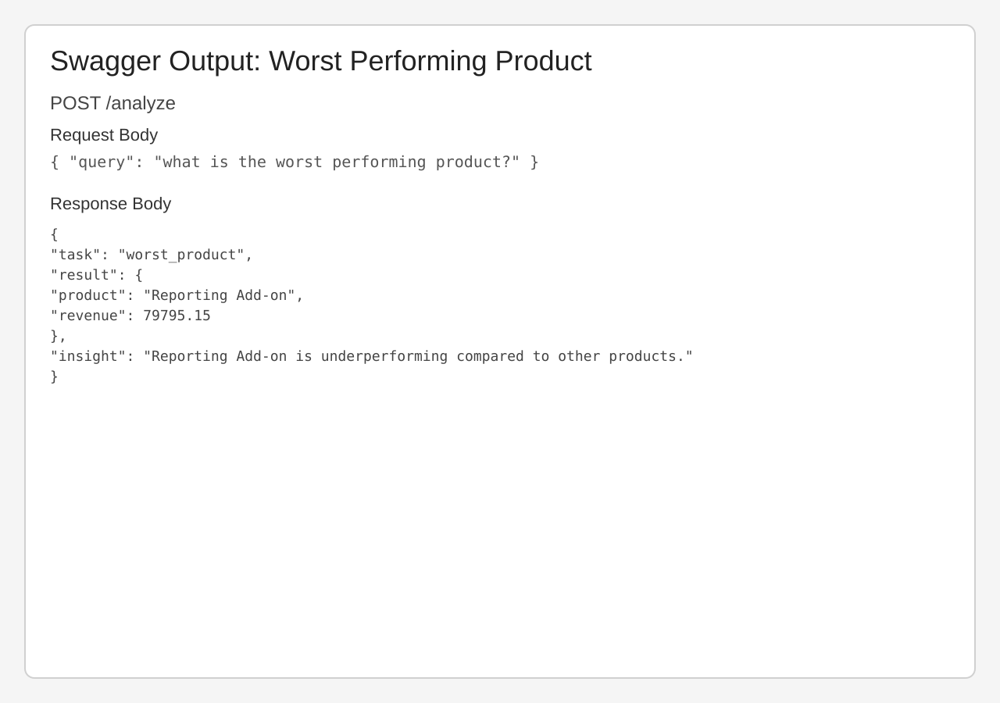

# InsightOps AI

InsightOps AI is a lightweight backend assistant for sales analytics. v0.3 adds an optional LLM decision layer on top of the v0.2 rule-based multi-intent foundation.

## Overview

The API receives a user query at POST /analyze, tries LLM intent parsing first, falls back to rule-based classification when needed, routes to the right sales tool, and returns a structured result plus a short insight.

## Current Implementation

InsightOps AI v2 is a rule-based multi-intent analytics backend for sales data. It classifies user queries, routes them to the appropriate tool, and returns structured results with short insights.

- Intent detection using keyword groups and pattern matching  
- Multi-intent routing (report, status, product insights, regional comparison)  
- Modular tool-based architecture (separate functions per task)  
- Data analysis using pandas on structured datasets  
- Structured JSON responses with short rule-based insights  
- Deterministic and testable design, ready for future LLM integration

## Key Features

- Multi-intent sales query classification
- Optional LLM-based intent parsing
- Automatic fallback to rule-based classification
- Adaptive model selection via environment variables
- Structured analytics responses
- Rule-based insights per intent
- FastAPI endpoint for easy testing in Swagger
- Unit-tested behavior


## Architecture

```
POST /analyze (query)
    ↓
LLM Decision Layer (intent JSON)
  ↓
Fallback to Rule-Based Classifier (if needed)
    ↓
Task Router
    ↓
Sales Tool Function
    ↓
Structured Result + Insight
```

**Layers:**
- API layer: `app/main.py`
- Agent layer: `app/agents/simple_agent.py`
- Tool layer: `app/tools/sales_tools.py`

## v0.2 to v0.3+ Evolution

- v0.2: rule-based multi-intent sales routing (`sales_report`, `sales_status`, `top_product`, `worst_product`, `sales_by_region`)
- v0.3+: multi-provider LLM-assisted decision layer with intelligent provider routing and adaptive model selection
- Keep it working: if LLM is disabled, all providers fail, or the service times out, the agent automatically falls back to the existing rule-based classifier

### Multi-Provider LLM Setup

v0.3+ supports three LLM providers in a priority chain:

1. **Groq** (Primary) — fast inference, good for real-time classification
2. **Hugging Face** (Secondary) — hosted open-source models, backup option
3. **Jetstream** (Tertiary) — gpt-oss-120b backup inference service

The system tries providers in order. If one fails (timeout, network error, invalid response), it automatically tries the next. If all LLM providers fail, the agent falls back to the rule-based classifier.

### Adaptive Model Selection

Model routing is lightweight and environment-driven:

- Easier queries route to a fast model
- Reasoning-heavy queries route to a stronger model
- Behavior is configured via environment variables

### Getting Started with LLM Providers

1. Copy `.env.example` to `.env`
2. Set `INSIGHTOPS_LLM_ENABLED=true` to enable LLM layer
3. Add API keys for the providers you want to use:
   - **Groq**: Get free key at https://console.groq.com
   - **Hugging Face**: Get token at https://huggingface.co/settings/tokens
   - **Jetstream**: Get key at https://jetstream.ai

4. (Optional) Reorder providers by setting `INSIGHTOPS_LLM_PROVIDER_ORDER=groq,huggingface,jetstream`

See [.env.example](.env.example) for all available configuration options.

### Default Environment Configuration

```bash
# Global LLM settings
INSIGHTOPS_LLM_ENABLED=false
INSIGHTOPS_LLM_TIMEOUT_SECONDS=5
INSIGHTOPS_LLM_PROVIDER_ORDER=groq,huggingface,jetstream

# Adaptive model selection
INSIGHTOPS_FAST_MODEL=gpt-4o-mini
INSIGHTOPS_STRONG_MODEL=gpt-4.1
INSIGHTOPS_STRONG_MODEL_MIN_TOKENS=12
INSIGHTOPS_STRONG_MODEL_KEYWORDS=compare,explain,why,forecast,breakdown

# Groq (Primary)
GROQ_API_KEY=
GROQ_API_URL=https://api.groq.com/openai/v1/chat/completions

# Hugging Face (Secondary)
HF_API_KEY=
HF_API_URL=https://api-inference.huggingface.co/models
HF_MODEL=meta-llama/Llama-2-7b

# Jetstream (Tertiary)
JETSTREAM_API_KEY=
JETSTREAM_API_URL=https://api.jetstream.ai/v1/chat/completions
JETSTREAM_MODEL=gpt-oss-120b
```

## v0.3+ Richer Insights

The `/analyze` endpoint now returns more intelligent and actionable insights. Each response includes:

- **summary**: A concise headline about the key finding
- **reasoning**: Context explaining why this finding matters to the business
- **recommendation**: A specific, actionable next step based on the analysis

Insights are returned as a multi-line string that combines these three elements for easy readability and programmatic parsing.

**Example - Top Product Query:**

```json
{
  "task": "top_product",
  "result": {
    "product": "Analytics Pack",
    "revenue": 217795.25,
    "percent_of_total_revenue": 31.5
  },
  "insight": "Analytics Pack is the top revenue generator in the portfolio.\n\nWith $217,795.25 in revenue (31.5% of total), Analytics Pack represents the strongest market segment and customer preference alignment.\n\nMaintain investment in Analytics Pack while leveraging its success to cross-sell and upsell complementary products to the same customer base.",
  "model_used": "rule-based-fallback"
}
```

The `insight` field contains:
1. A direct summary
2. Business context and significance
3. An actionable recommendation

When the LLM layer is enabled and succeeds, `model_used` shows the model name (e.g., `"llama-3.1-8b-instant"`). When fallback occurs, it shows `"rule-based-fallback"`.

## Website Request Bodies and Responses

### 1. Sales Report

Request body:

```json
{ "query": "sales report" }
```

Response body:

```json
{
  "task": "sales_report",
  "result": {
    "total_revenue": 690383.75,
    "average_daily_revenue": 32875.42,
    "top_product": "Analytics Pack",
    "worst_product": "Reporting Add-on"
  },
  "insight": "Analytics Pack leads the portfolio while Reporting Add-on underperforms.\n\nWith $690,383.75 in total revenue and $32,875.42 daily average, the portfolio concentration on top performers indicates opportunity to optimize underperformers.\n\nConsider strategies to boost Reporting Add-on's performance, such as improved marketing, pricing adjustments, or feature enhancements.",
  "model_used": "rule-based-fallback"
}
```



### 2. Sales Status / Trend

Request body:

```json
{ "query": "how are sales doing this week?" }
```

Response body:

```json
{
  "task": "sales_status",
  "result": {
    "total_revenue": 690383.75,
    "average_daily_revenue": 32875.42,
    "trend": "stable",
    "daily_variation_pct": 22.05,
    "daily_change_percent": -2.35
  },
  "insight": "Sales performance is holding steady with minor daily fluctuations.\n\nThe relatively stable trend (daily change: -2.35%) suggests a balanced market environment without major disruptive factors.\n\nFocus on incremental improvements to product offerings, customer retention, and operational efficiency.",
  "model_used": "rule-based-fallback"
}
```



### 3. Compare Sales by Region

Request body:

```json
{ "query": "compare sales by region" }
```

Response body:

```json
{
  "task": "sales_by_region",
  "result": {
    "best_region": "East",
    "best_region_revenue": 250093.02,
    "worst_region": "South",
    "worst_region_revenue": 196046.47,
    "regions": [
      {
        "region": "East",
        "revenue": 250093.02
      },
      {
        "region": "North",
        "revenue": 244244.26
      },
      {
        "region": "South",
        "revenue": 196046.47
      }
    ]
  },
  "insight": "Regional sales performance varies, with East leading the way.\n\nEast generated $250,093.02, representing the strongest regional execution. Geographic analysis reveals expansion opportunities in underperforming regions.\n\nAnalyze East's success factors and replicate them in lower-performing regions. Consider targeted regional campaigns and localized sales strategies.",
  "model_used": "rule-based-fallback"
}
```



### 4. Worst Performing Product

Request body:

```json
{ "query": "what is the worst performing product?" }
```

Response body:

```json
{
  "task": "worst_product",
  "result": {
    "product": "Reporting Add-on",
    "revenue": 79795.15,
    "percent_of_total_revenue": 11.6
  },
  "insight": "Reporting Add-on is underperforming relative to other offerings.\n\nAt $79,795.15 (11.6% of total revenue), Reporting Add-on shows weak market adoption. This may signal product-market fit issues, poor positioning, or insufficient customer awareness.\n\nEither reinvest in Reporting Add-on with targeted improvements and marketing, or consider discontinuing it to free resources for higher-performing products.",
  "model_used": "rule-based-fallback"
}
```



## Environment Setup

### Prerequisites

- Python 3.10+ (3.11 recommended)
- conda or compatible environment manager

### Create and Activate Environment

```bash
cd insightops-ai
conda env create -f environment.yml
conda activate insightops-ai
```

## Run API

```bash
uvicorn app.main:app --reload --host 127.0.0.1 --port 8010
```

Open Swagger UI at http://127.0.0.1:8010/docs

## Testing

```bash
python -m unittest discover -s tests -p "test_*.py"
python -m unittest discover -s tests -p "test_*.py" -v
```

## Project Structure

```
insightops-ai/
├── app/
│   ├── main.py
│   ├── agents/
│   │   └── simple_agent.py
│   ├── tools/
│   │   └── sales_tools.py
│   └── __init__.py
├── docs/
│   └── screenshots/
├── data/
│   ├── sales.csv
│   └── generate_sales_data.py
├── tests/
│   ├── test_agent_loop.py
│   └── README.md
├── environment.yml
├── GETTING_STARTED.md
└── README.md
```

## Documentation

- [GETTING_STARTED.md](GETTING_STARTED.md)
- [tests/README.md](tests/README.md)
