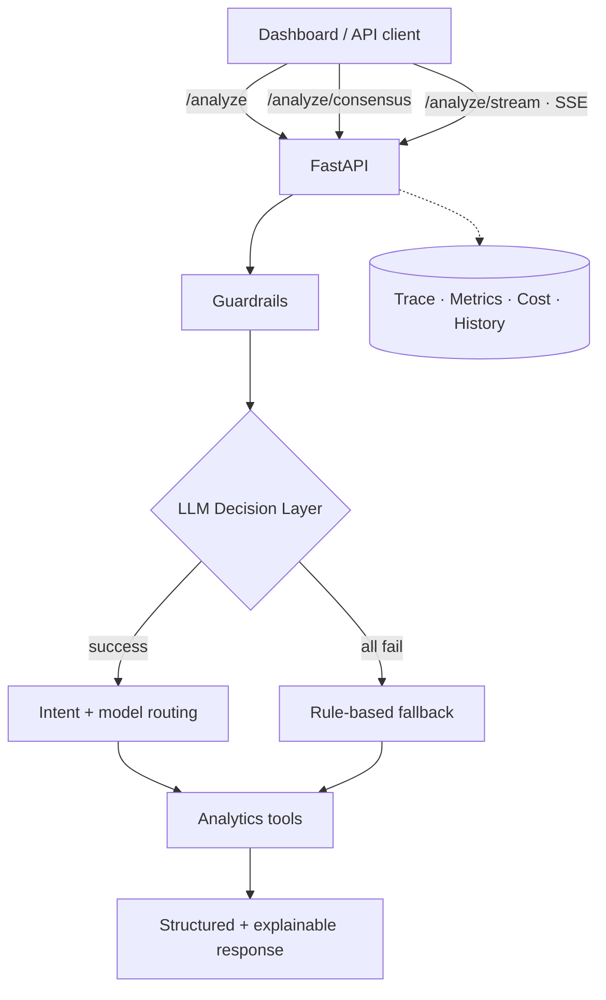
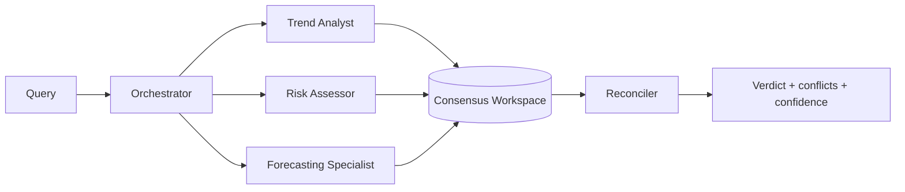

<div align="center">

# 🧠 InsightOps AI

### Agentic sales-analytics platform — multi-agent consensus, resilient LLM routing, and first-class LLMOps.

[](https://github.com/faris-agour/insightops-ai/actions/workflows/ci.yml)
[](https://www.python.org/)
[](https://fastapi.tiangolo.com/)
[](https://docs.astral.sh/ruff/)
[](https://mypy.readthedocs.io/)
[](LICENSE)

*Turn a natural-language business question into a structured, explainable, fully-traced answer —
or convene a panel of specialized AI agents to debate it and reach consensus.*

</div>

---

## ✨ Why this project stands out

Most analytics APIs return numbers. **InsightOps AI returns reasoning you can trust and observe.**

- 🤝 **Multi-agent consensus** — three specialized agents (Trend, Risk, Forecast) analyze
  independently, then a **Reconciler** synthesizes one verdict and *flags conflicts* between optimism and risk.
- 🛰️ **LLMOps built-in** — per-request tracing, versioned prompts, guardrails, token-cost tracking,
  an eval harness, and Prometheus metrics. Not bolted on — part of the request path.
- 🛡️ **Resilient by design** — multi-provider LLM chain (Groq → Hugging Face → Jetstream) with a
  circuit breaker, per-provider timeouts, and a **deterministic fallback that never fails**.
- 🔌 **Runs anywhere, instantly** — a built-in **mock LLM provider** means the whole pipeline (agents
  included) works offline with **zero API keys**. Add keys to upgrade to real reasoning.
- 🎨 **Interactive dashboard** — a zero-build single-page app with live SSE streaming, the agent
  panel, and an auto-refreshing observability view. Open `/` and demo it.

> ⚡ **30-second demo:** `pip install -r requirements.txt && uvicorn app.main:app --port 8010` → open <http://127.0.0.1:8010>

---

## 🏗️ Architecture at a glance



Full diagrams (consensus flow, provider chain, module map) live in
**[docs/ARCHITECTURE.md](docs/ARCHITECTURE.md)**.

---

## 🤝 Multi-agent consensus



```bash
curl -s -X POST http://127.0.0.1:8010/analyze/consensus \
  -H "Content-Type: application/json" \
  -d '{"query":"what is the outlook and the risks?"}'
```

```jsonc
{
  "agent_count": 3,
  "findings": [
    { "agent": "Trend Analyst",          "role": "trend",    "source": "llm", "confidence": 0.68, "insight": "Momentum is heading downwards…" },
    { "agent": "Risk Assessor",          "role": "risk",     "source": "llm", "confidence": 0.74, "insight": "Potential revenue spike on 2026-01-17…" },
    { "agent": "Forecasting Specialist", "role": "forecast", "source": "llm", "confidence": 0.90, "insight": "Revenue expected to keep increasing…" }
  ],
  "reconciled": {
    "source": "llm",
    "confidence": 0.73,
    "insight": "Momentum is softening, but an anomalous spike may offset it while the forecast stays positive…",
    "conflicts": ["Optimistic forecast coexists with detected anomalies — growth may be fragile."]
  },
  "trace_id": "a1b2c3d4e5f6a7b8"
}
```

Each agent uses a real LLM when keys are present and a deterministic narrative otherwise — so this
endpoint **always works**, online or offline.

---

## 🛰️ LLMOps & observability

| Capability | What you get | Endpoint / entry point |
|---|---|---|
| **Tracing** | `trace_id` + timed spans per request | `GET /traces`, `GET /traces/{id}` |
| **Prompt registry** | versioned, centralized prompts | `GET /prompts` |
| **Guardrails** | prompt-injection screening + PII redaction in logs | automatic |
| **Cost tracking** | per-model token cost estimate | `GET /metrics` → `llm_cost_usd` |
| **Metrics** | counters, p50/p95 latency, tokens, breaker, cache | `GET /metrics`, `GET /metrics/prometheus` |
| **Evaluation** | golden-set accuracy gate (CI-enforced) | `python -m app.eval.run` |
| **Structured logs** | single-line JSON for aggregation | `INSIGHTOPS_JSON_LOGS=true` |

```text
$ python -m app.eval.run
 Accuracy : 100.0%  (26/26)
   anomaly_detection   3/3 (100%)   forecast_revenue   3/3 (100%)   …
```

---

## 🚀 Quickstart

### Option A — pip

```bash
git clone https://github.com/faris-agour/insightops-ai.git
cd insightops-ai
pip install -r requirements.txt
uvicorn app.main:app --reload --host 127.0.0.1 --port 8010
```

### Option B — conda

```bash
conda env create -f environment.yml
conda activate insightops-ai
uvicorn app.main:app --reload --port 8010
```

### Option C — Docker

```bash
docker compose up --build       # → http://127.0.0.1:8010
```

Then open:

- 🎨 **Dashboard** → <http://127.0.0.1:8010/>
- 📚 **Swagger docs** → <http://127.0.0.1:8010/docs>
- 📊 **Metrics** → <http://127.0.0.1:8010/metrics>

> **No API keys?** No problem — the mock provider keeps everything working. To enable real LLMs,
> copy `.env.example` to `.env` and set `INSIGHTOPS_LLM_ENABLED=true` plus any of
> `GROQ_API_KEY` / `HF_API_KEY` / `JETSTREAM_API_KEY`.

---

## 🔌 API endpoints

| Method | Endpoint | Purpose |
|---|---|---|
| `GET`  | `/` | Interactive dashboard |
| `GET`  | `/api` | Service banner / version |
| `GET`  | `/health` | Service · data · provider health |
| `GET`  | `/metrics` · `/metrics/prometheus` | Metrics (JSON / Prometheus) |
| `GET`  | `/traces` · `/traces/{id}` | Request traces |
| `GET`  | `/prompts` | Registered prompt versions |
| `GET`  | `/history` | Recent analyzed queries |
| `POST` | `/analyze` | Single explainable analysis |
| `POST` | `/analyze/consensus` | **Multi-agent consensus** |
| `POST` | `/analyze/stream` | Streaming analysis (SSE) |
| `POST` | `/admin/cache/invalidate` | Clear sales cache |

---

## 🧪 Quality gate

The same checks CI enforces, in one command:

```bash
make check     # ruff (lint+format) · mypy · pytest · eval
```

- ✅ **62 hermetic tests** (no network) — agents, LLMOps, consensus, dashboard, resilience.
- ✅ **ruff** clean · **mypy** clean over `app/`.
- ✅ **eval** accuracy gate on every push.
- ✅ **Docker** image builds in CI.

---

## 🗂️ Project structure

```text
insightops-ai/
├── app/
│   ├── main.py              # FastAPI app + routes + dashboard mount
│   ├── agents/              # decision loop, providers, prompts, multi-agent consensus
│   ├── analysis/            # anomaly · forecast · trend
│   ├── core/                # config · tracing · guardrails · pricing · metrics · cache · breaker
│   ├── eval/                # golden dataset + eval runner
│   ├── tools/               # deterministic sales analytics
│   └── static/              # zero-build dashboard
├── tests/                   # pytest suite (hermetic)
├── docs/ARCHITECTURE.md     # deep-dive diagrams
├── Dockerfile · docker-compose.yml · Makefile
└── .github/workflows/ci.yml
```

---

## 🧭 Configuration highlights

| Variable | Default | Purpose |
|---|---|---|
| `INSIGHTOPS_LLM_ENABLED` | `false` | Turn the LLM decision layer on |
| `INSIGHTOPS_LLM_MOCK_ENABLED` | `true` | Offline deterministic fallback provider |
| `INSIGHTOPS_LLM_PROVIDER_ORDER` | `groq,huggingface,jetstream` | Provider preference chain |
| `INSIGHTOPS_FAST_MODEL` / `_STRONG_MODEL` | llama 8b / 70b | Adaptive model routing |
| `INSIGHTOPS_CB_FAILURE_THRESHOLD` | `3` | Circuit-breaker trip threshold |
| `INSIGHTOPS_JSON_LOGS` | `false` | Structured JSON logging |

See [.env.example](.env.example) for the full list.

---

## 🛣️ Roadmap & changelog

Version history is tracked in **[CHANGELOG.md](CHANGELOG.md)**. Current release: **v0.5.0**
(agentic consensus + LLMOps + dashboard + CI/Docker).

## 🤝 Contributing

Contributions are welcome — see **[CONTRIBUTING.md](CONTRIBUTING.md)**. The project runs fully
offline, so you can start without any API keys.

## 📄 License

[MIT](LICENSE) © 2026 Faris Abouagour

<div align="center">
<sub>Built with FastAPI · pandas · Chart.js — designed for clarity, resilience, and observability.</sub>
</div>
