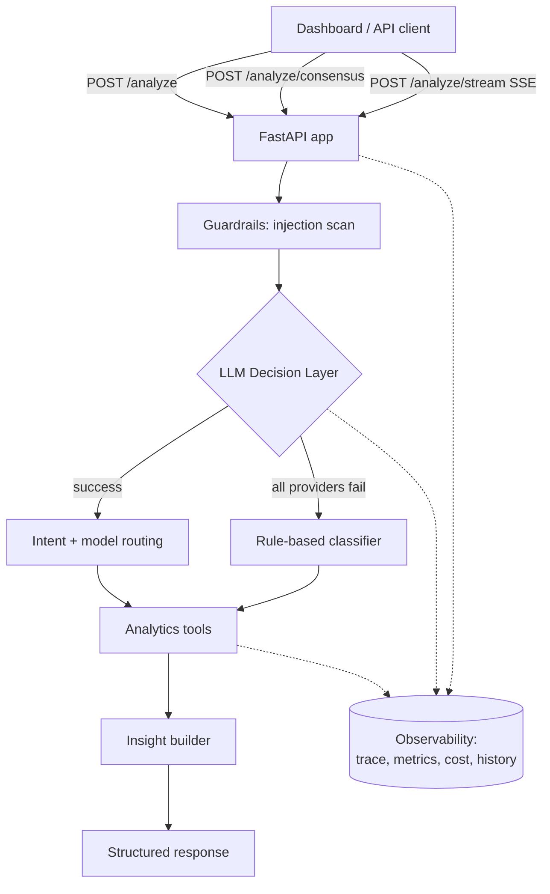
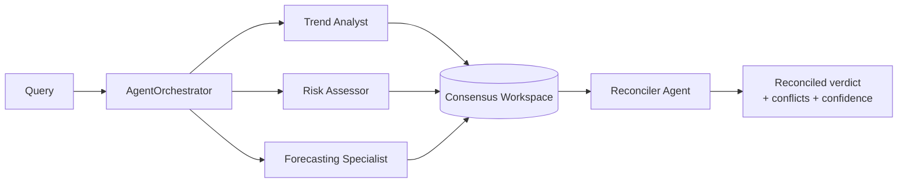
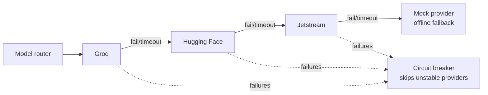

# Architecture

InsightOps AI turns natural-language sales questions into structured, explainable,
and **observable** answers. It layers a resilient LLM decision path over deterministic
analytics, and adds a multi-agent consensus mode plus a full LLMOps spine.

## High-level flow



Every request runs inside a **trace** (`trace_id`) composed of timed **spans**
(`guardrails`, `decision`, `llm_provider`, `tool_execution`, `insight`). Traces are
retrievable at `/traces/{id}` and feed latency, token, and cost metrics.

## Multi-agent consensus



Each specialized agent:

1. **gathers** deterministic evidence from its tool (`analyze_trend`, `detect_anomalies`,
   `forecast_revenue`) — always works offline.
2. attempts an **LLM perspective** using its versioned role prompt (real providers only).
3. **falls back** to a deterministic narrative when no LLM is configured.

The **Reconciler** detects cross-agent conflicts (e.g. an optimistic forecast that
coexists with detected anomalies), then synthesizes one executive verdict with an
overall confidence score — via LLM when available, deterministically otherwise.

## Resilience: provider chain + circuit breaker



- Provider order is configurable (`INSIGHTOPS_LLM_PROVIDER_ORDER`).
- A **circuit breaker** temporarily skips a provider after repeated failures.
- The **mock provider** guarantees the LLM path resolves even with no keys, so demos,
  tests, and CI exercise the full pipeline deterministically.

## LLMOps spine

| Concern | Implementation |
|---|---|
| Tracing | `app/core/tracing.py` — contextvar-based spans, in-memory `TraceStore` |
| Prompt management | `app/agents/prompts.py` — versioned `PromptRegistry` |
| Guardrails | `app/core/guardrails.py` — injection screening + PII redaction |
| Cost tracking | `app/core/pricing.py` — per-model token cost estimation |
| Metrics | `app/core/metrics.py` — counters, p50/p95 latency, tokens, cost, Prometheus |
| Evaluation | `app/eval/` — golden dataset + scored runner, gated in CI |

## Module map

```
app/
├── main.py                  # FastAPI app, routes, static dashboard mount
├── schemas.py               # Pydantic request/response models
├── agents/
│   ├── simple_agent.py      # orchestration loop (decide -> tool -> insight), traced
│   ├── llm_decision.py      # provider chain + circuit breaker + validation
│   ├── llm_providers.py     # Groq / HF / Jetstream / Mock providers
│   ├── llm_text.py          # generic JSON completion for agents
│   ├── model_router.py      # fast vs strong model selection
│   ├── prompts.py           # versioned prompt registry
│   ├── base.py              # Agent ABC + AgentFinding
│   └── consensus.py         # specialized agents + workspace + reconciler + orchestrator
├── analysis/advanced_analytics.py   # anomalies, forecast, trend
├── tools/sales_tools.py     # deterministic sales analytics
├── core/                    # config, cache, circuit_breaker, metrics, tracing, guardrails, pricing, logging
├── services/query_history.py
├── eval/                    # golden dataset + eval runner
└── static/                  # zero-build dashboard (index.html, app.js, styles.css)
```
