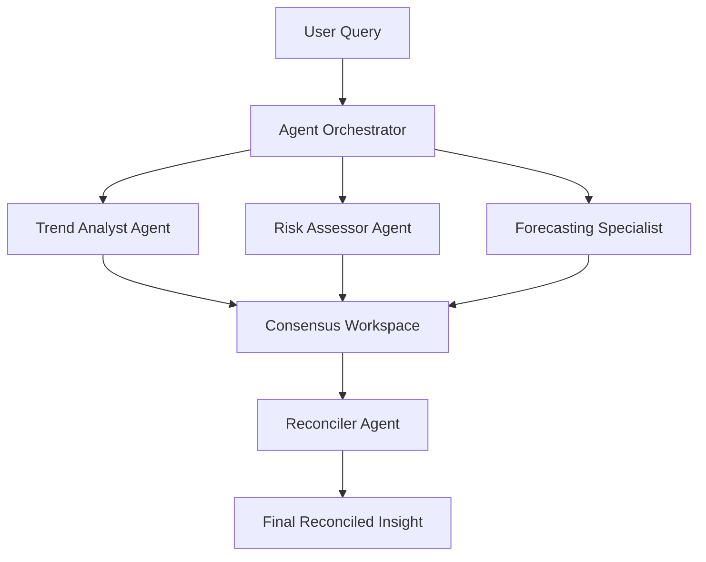

# Architecture for Collaborative Multi-Agent Consensus

## Workflow

## Key Components
1. **Agent Orchestrator**: Dispatches the query to multiple specialized agents.
2. **Specialized Agents**: Independent LLM agents tasked with specific analytical perspectives.
3. **Consensus Workspace**: A shared data structure (or temporary database table) that collects findings from all agents.
4. **Reconciler Agent**: The final "judge" that reads all inputs from the workspace, resolves conflicts, and generates a cohesive final report.
